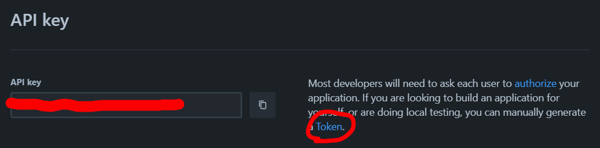

# DevOps Apprenticeship: Project Exercise

> If you are using GitPod for the project exercise (i.e. you cannot use your local machine) then you'll want to launch a VM using the [following link](https://gitpod.io/#https://github.com/CorndelWithSoftwire/DevOps-Course-Starter). Note this VM comes pre-setup with Python & Poetry pre-installed.

## System Requirements

The project uses poetry for Python to create an isolated environment and manage package dependencies. To prepare your system, ensure you have an official distribution of Python version 3.8+ and install Poetry using one of the following commands (as instructed by the [poetry documentation](https://python-poetry.org/docs/#system-requirements)):

### Poetry installation (Bash)

```bash
curl -sSL https://install.python-poetry.org | python3 -
```

### Poetry installation (PowerShell)

```powershell
(Invoke-WebRequest -Uri https://install.python-poetry.org -UseBasicParsing).Content | py -
```

You can check poetry is installed by running `poetry --version` from a terminal.

**Please note that after installing poetry you may need to restart VSCode and any terminals you are running before poetry will be recognised.**

## Dependencies

The project uses a virtual environment to isolate package dependencies. To create the virtual environment and install required packages, run the following from your preferred shell:

```bash
$ poetry install
```

You'll also need to clone a new `.env` file from the `.env.template` to store local configuration options. This is a one-time operation on first setup:

```bash
$ cp .env.template .env  # (first time only)
```

The `.env` file is used by flask to set environment variables when running `flask run`. This enables things like development mode (which also enables features like hot reloading when you make a file change).

## Setting up Trello

You'll need to set-up a [Trello account](https://trello.com/signup), Trello board, a 'To-Do' list in that board, and create a [Trello API key](https://developer.atlassian.com/cloud/trello/guides/rest-api/api-introduction/#managing-your-api-key). 
Then create a API token:Create a API Token for Trello.
This can be done by clicking the “Token” link on the same page where your API key is displayed


Once you've done this, replace the TRELLO_API_KEY and TRELLO_API_TOKEN values in your .env file with you API key and token.


Finally, [get your board id](https://developer.atlassian.com/cloud/trello/guides/rest-api/api-introduction/#your-first-api-call) and replace the TRELLO_TO_DO_BOARD_ID with your board's ID. Do the same with the organisation id (the `idOrganization` field in the same API response), replacing the TRELLO_ORGANIZATION_ID with it.

## Running the App

Once the all dependencies have been installed, start the Flask app in development mode within the Poetry environment by running:
```bash
$ poetry run flask run
```

You should see output similar to the following:
```bash
 * Serving Flask app 'todo_app/app'
 * Debug mode: on
WARNING: This is a development server. Do not use it in a production deployment. Use a production WSGI server instead.
 * Running on http://127.0.0.1:5000
Press CTRL+C to quit
 * Restarting with stat
 * Debugger is active!
 * Debugger PIN: 113-666-066
```
Now visit [`http://localhost:5000/`](http://localhost:5000/) in your web browser to view the app.

## Testing the App

Unit and integration tests can be found in the top level `tests` directory.

End to end (Selenium) tests can be found in the top level `e2eTests` directory.

To run all tests in the project from the terminal, run `poetry run pytest`

To run all tests in a specific file run `poetry run pytest <path>/<to>/<test file>.py`

To run a specific test on its own run `poetry run pytest <path>/<to>/<test file>.py::<name of test>`
